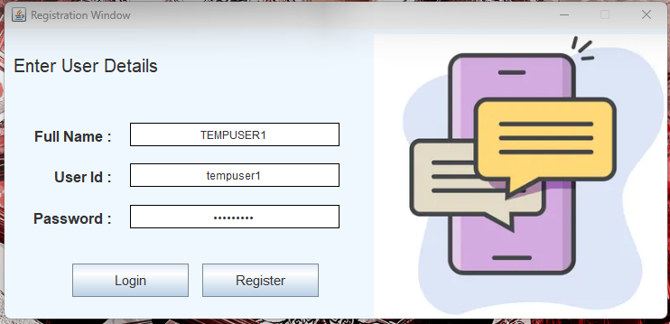
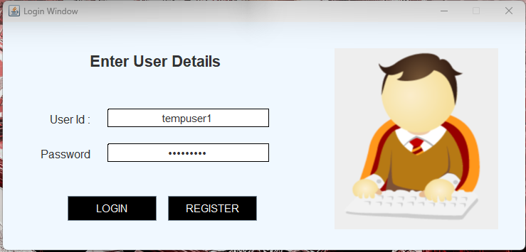
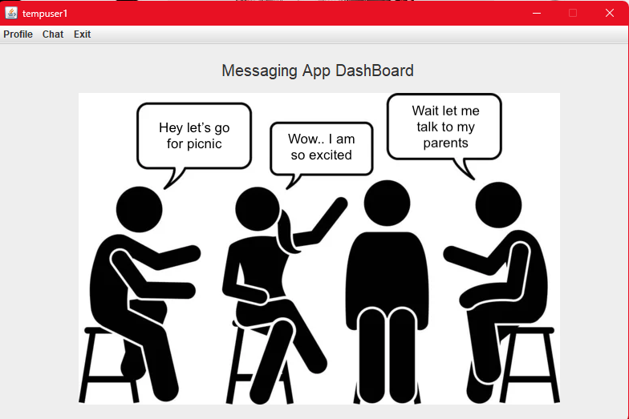
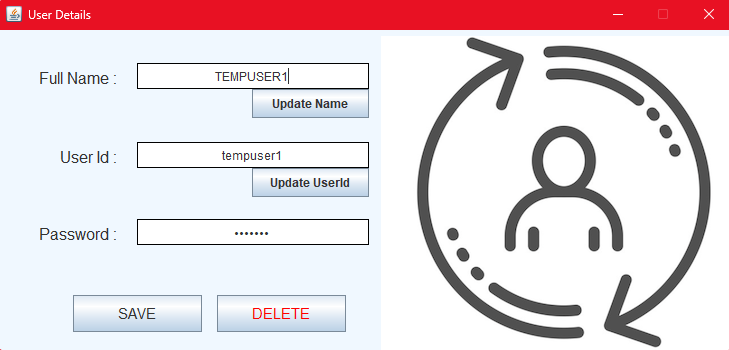
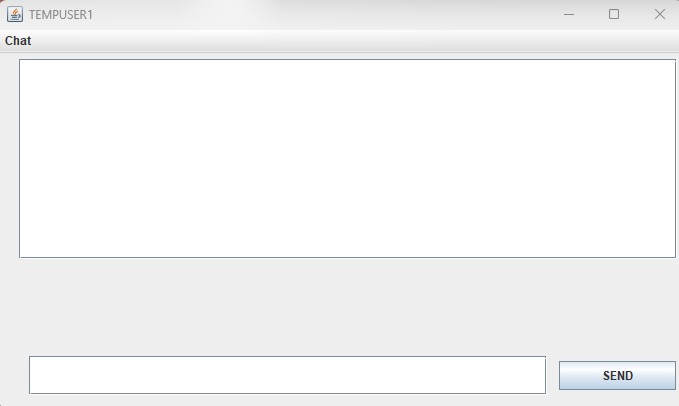
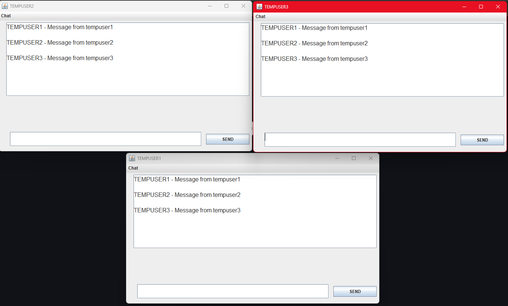

# Real Time Chat Application in Java using Socket Programming, MySQL, and Swing

A real-time messaging application built using Core Java, Swing, Socket Programming, and MySQL. This project demonstrates a complete client-server architecture alongside user authentication.

---

## 📋 Features

- 🔐 **Login Authentication** using MySQL
- 💬 **Real-time Messaging and Broadcasting** via Sockets
- 🧵 **Multithreaded Server to support multiple clients**
- 🎨 **Java Swing GUI for client chat interface**

---

## Tech Stack

- **Java (JDK 8+)** – Core application logic and multithreading
- **Java Socket Programming (TCP/IP)** – Real-time client-server communication
- **Java Swing** – GUI components and event-driven interface
- **MySQL** – Persistent storage of user credentials
- **MySQL JDBC Driver** – JDBC connector 
- **Multithreading** – Handling concurrent client sessions on the server
- **Git** – Version control 

---

## Project Structure

```
│── src
│   ├── multi
│   │   ├── user
│   │   │   ├── chatapp
│   │   │   |       ├── network             # Multithreaded Server and client
│   │   │   |       |       ├── Client.java
│   │   │   |       |       ├── Server.java
│   │   │   |       |       ├── ClientWorker.java
│   │   │   |       |       ├── ServerWorker.java

│   │   │   │       ├── utils               # Utility classes
│   │   │   |       |       ├── ConfigReader.java
│   │   │   |       |       ├── DBConnection.java
│   │   │   |       |       ├── Encryption.java
│   │   │   |       |       ├── KeyConstants.java
│   │   │   |       |       ├── UserInfo.java

│   │   │   │       ├── users               # Core Application Logic
│   │   │   |       |       ├── dao         # Data Access Object
│   │   │   |       |       |     ├── UserDAO.java

│   │   │   |       |       ├── dto         # Data Transfer Object
│   │   │   |       |       |     ├── UserDTO.java

│   │   │   |       |       ├── validation  # Input Validation
│   │   │   |       |       |     ├── InputValidation.java

│   │   │   |       |       ├── view        # GUI
│   │   │   |       |       |     ├── ClientChatScreen.java
│   │   │   |       |       |     ├── DashBoard.java
│   │   │   |       |       |     ├── Register.java
│   │   │   |       |       |     ├── UserDetails.java
│   │   │   |       |       |     ├── UserView.java
|   │── assets
│   |   ├── icons                             # Image assets like send button icon, profile, etc.
│   |   ├── screenshots                       # Screenshots of UI for documentation
│── database
│   ├── chatapp.sql                           # SQL file for creating tables and inserting sample data
│── lib
│   ├── mysql-connector-java-8.0.28.jar       # JDBC driver for MySQL
│   ├── mysql-connector-j-8.0.33.jar 
│── bin (Compiled .class files and assets)
```


---

## 🧠 System Design & Application Workflow

The application follows a modular client-server architecture, enabling real-time message exchange over sockets with persistent user credential storage via MySQL.

### 🔧 Backend Architecture

- Server acts as a central hub, always running and waiting for client connections via TCP sockets. It maintains a list of all active clients and facilitates message Broadcasting.

- Database layer stores the user credentials securely for login authentication -> Username and encrypted Password.

- Database layer stores the user credentials securely for login authentication -> Username and encrypted Password.

### 🖥️ Client-Side Flow

- Each client is a Swing-based desktop interface with:
    - Login & Signup Windows for account creation and authentication
    - Main Chat Dashboard with options for entering chat window, viewing user details and exiting app
    - Chat window with a message nput field to send and display messages

---


---

## 🖼️ Screenshots

### 📝 Registration Window
**Form interface for new user registration using Java Swing, capturing credentials and storing them in MySQL via JDBC.**

<

### 🔐 Login Window
**Login screen with Swing-based input fields, authenticating user credentials through the database using JDBC.**



### 🏠 Main Dashboard
**Home screen after successful login, displaying the gateway to public chats.**



### 👤 User Details Window
**Displays the username, password and userid of the currently logged-in user, with an option to change them.**



### 💬 Chat Window
**Chat interface supporting public and private conversations, built using Swing panels, text areas, and socket streams for real-time communication.**



### 📢 Broadcasting Messages to All Users
**A demo showing real-time broadcasting of messages across three users, each running their own client instance, with synchronized delivery via the server.**



---

## 📆 Getting Started

### 📁 Prerequisites

- **Java JDK (v8 or above)**  
- **MySQL Server**

---

### 🗃️ Database Setup

1. **Create a new database**  
   Open MySQL and run:

   ```sql
   CREATE DATABASE <database_name>;
   USE <database_name>;
   ```
2. **Create the table for storing user credentials**  

    ```sql
    CREATE TABLE users (
        FullName VARCHAR(50),
        userid VARCHAR(50) ,
        password VARCHAR(50)
    );
   ```

4. **Configure DB credentials in the code**
    ```
    Connection conn = DriverManager.getConnection("jdbc:mysql://<host>>:3306/<db_name>", "<db_username>", "<db_password>");
    ```

---

###  🚀 Clone and Run

1. **Clone the repository**
```
$ git clone https://github.com/nogi2k2/Whispr.git
```

2. **Navigate into the project directory**
```
$ cd <directory_name>
```

3. **Run the application (Start the Server)**
```
$ java multi.user.chatapp.network.Server
```

4. **Launch clients Individually**
```
$ java multi.user.chatapp.user.UserView (If Logging in)

$ java multi.user.chatapp.user.Register (If Signing up)
```

---
